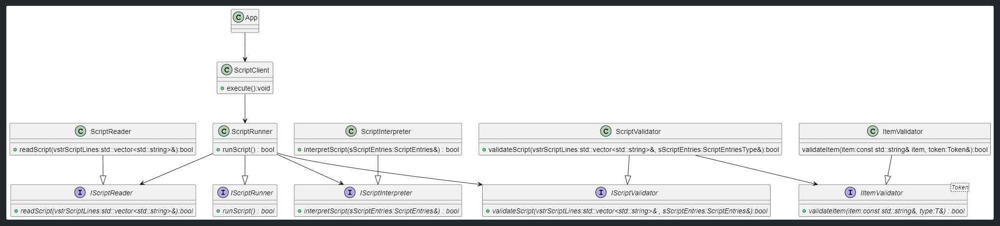

# uScript (Micro Script)
uScript is a versatile and lightweight script interpreter designed to execute commands implemented in external plugins (shared libraries such as .dll on Windows or .so on Linux). It is ideal for automation tasks where modularity, simplicity, and plugin extensibility are key.

## Comments
uScript supports both line and block comments:

### Line Comments:
Start with # 

    # This is a full line comment
    PLUGIN.COMMAND arg1 arg2  # This is an end-of-line comment

### Block Comments:
Start with \--- and end with \!--, each on its own line

    \---
    PLUGIN.COMMAND arg1 arg2
    PLUGIN.COMMAND arg1 arg2
    \!--

## Command Syntax
Commands follow this structure: 

    PLUGIN_NAME.COMMAND_NAME arg1 arg2 ... argN

- Plugin and command names must be uppercase. 
- Arguments are case-insensitive, but interpretation depends on the plugin. 
- A failed command will halt script execution unless configured otherwise. 

### Example:

    UART.OPEN   COM1 115200
    UART.WRITE  E245AA55BBEDFF
    UART.CLOSE

## Macros
The container for a macro value is a string; interpretation is up to the plugin. 

### Constant Macros
 - Defined using := 
 - Replaced at validation time (before execution) 
 - Used for static values 
 - Accessed using $MACRO_NAME 

#### Example
    BAUDRATE := 115200
    UART_PORT := COM1
    UART.OPEN $UART_PORT $BAUDRATE

### Variable Macros
 - Defined using ?= 
 - Used to capture output from a command and reuse it 
 - Evaluated at runtime 

#### Example:
    PORT ?= UART.WAIT_FOR_PORT 3000
    UART.INIT $PORT $BAUDRATE

## Conditional Execution
 - uScript supports basic conditional flow control like:

###
    IF condition GOTO label
    GOTO label
    LABEL label

 - Labels must exist and can only be jumped to forward 
 - Conditions are typically returned by commands or evaluated by plugins 
 - Valid values of Conditions: TRUE, FALSE, !TRUE, !FALSE 
 - While commands can return any value, a dedicated plugin can interpret these results by comparing them to other returned or constant values, and convert them into standardized strings such as `TRUE` or `FALSE`.

### Example:
    IF $RETVAL GOTO END_OF_SCRIPT
    . . .
    LABEL END_OF_SCRIPT

## **Platform Compatibility**
- Designed to work across:
  - Windows (MSVC, MinGW)
  - Linux

## **Build**
- The build process is designed for a Linux environment:
  - Linux: Execute `./linux_build.sh` to start the build.
  - MinGW: Install via `sudo apt-get install mingw-w64` on Linux, then run `./windows_build.sh`.
  - Microsoft Visual Studio: Open the project folder, CMake will automatically detect the configuration, allowing you to initiate the build.

## Implementation class diagram

# Note:
### This package is under active development. While the basic functionality is in place, new features are planned for future releases.