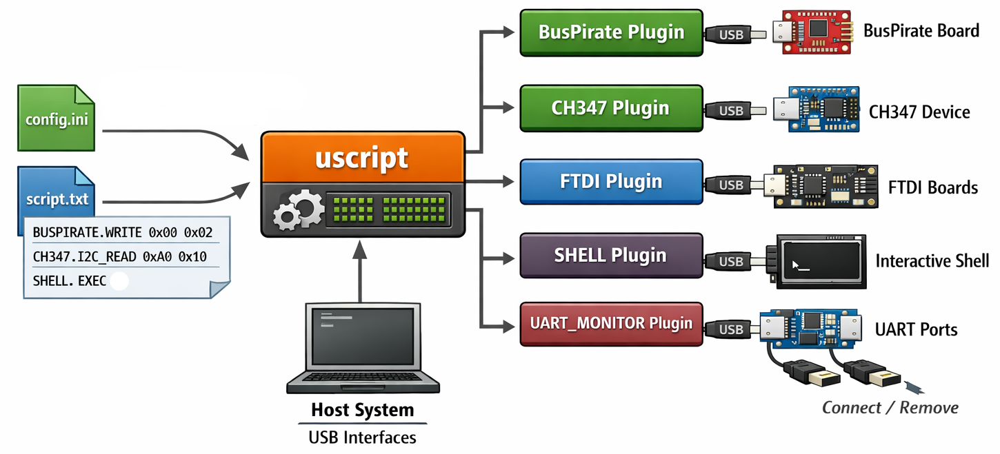

# uScript — Scripting & Automation Framework

## Overview

**uScript** is a C++ scripting and hardware-automation framework built around two complementary script interpreters and a plugin ecosystem that abstracts real hardware interfaces. It is designed to drive embedded-systems testing, hardware bring-up, and protocol-level automation with a clean, readable scripting syntax and a strongly layered, interface-driven architecture.

The framework ships as a standalone executable plus a set of independently loadable shared-library plugins (`.so` / `.dll`). Scripts are plain text files processed at runtime with no pre-compilation step.



---

## Communication scripts

Some of the plugins used for communication purposes (e.g., those supporting UART, SPI, or I²C communication) can run their own scripts to enable fast interaction with the device.
These scripts are simpler than the main uscript scripts and are optimized for basic communication operations such as:

- send
- receive
- send/receive
- receive/send
- delays between commands

This allows efficient low-level communication sequences when interacting with hardware devices.<br>
[Communication scripts description](sources/src/script/comm/README.md)<br>

---

## SHELL plugin

A special plugin called SHELL allows the main script to enter an interactive command-line interface where the user can manually:

- load plugins
- call plugin commands (which may also trigger communication scripts if the plugin supports them)
- execute commands implemented directly in the shell
- load shell-specific plugins that provide specialized command sets<br>
[Shell plugin description](sources/src/plugin/shell_plugin//README.md)<br>

Because of this architecture, the system is highly flexible and can be adapted to a wide range of testing and hardware interaction scenarios.

---

## Create New Plugins

Creating a new plugin is very simple. Just execute the script `sources/src/plugin/create_plugin.sh`
with one argument: the name of the plugin to create.

```bash
./create_plugin.sh YOUR_PLUGIN_NAME
```

After this, the new plugin can be built.
However, to install it, you need to manually copy the following line into the main `CMakeLists.txt`:

```cmake
install(TARGETS YOUR_PLUGIN_NAME_plugin ${LIB_INSTALL_TYPE} DESTINATION ${INSTALL_PLUGIN_DIR})
```

---

## Build Process

If the required tools are installed:

* C++ compiler for Linux builds
* MinGW for Windows builds on Linux (`sudo apt update` followed by `sudo apt install mingw-w64)`)

simply run:

```bash
# Build Linux application and plugins
./linux_build.sh

# Build Windows application and plugins
./windows_build.sh
```

Alternatively, Visual Studio can be used to build Windows applications on Windows OS.

---

## Full documentation

[General description](documentation/GENERAL_DESCRIPTION.md)<br>
[Scripting Language Reference](documentation/SCRIPTING_LANGUAGE_REFERENCE.md)<br>
[Scripting Language Tutorial](documentation/SCRIPTING_LANGUAGE_TUTORIAL.md)<br>
[Math Comand Reference Manual](documentation/MATH_COMMAND_REFERENCE.md)<br>
