## How I²C scanning works

An I²C scan is essentially a **brute-force address probe**: the master walks every possible 7-bit address (0x01–0x7F, skipping reserved ones) and checks whether any device responds. Here's the mechanism at each layer.

---

### The protocol-level transaction (per address)

For each address candidate, the master performs a minimal write transaction:

1. **START condition** — SDA pulled low while SCL is high. This "claims the bus."
2. **Address byte** — 7 address bits + 1 R/W̄ bit (set to `0` = write). Clocked out MSB-first.
3. **ACK slot** — the master releases SDA and pulses SCL once. The slave *must* pull SDA low to acknowledge. If SDA stays high, no slave is there.
4. **STOP condition** — master releases the bus immediately after the ACK slot.

That's it — no data bytes are ever sent. The transaction is the shortest legal I²C exchange possible.

---

### How presence is confirmed

The key is **who drives SDA during the ACK slot**:

| SDA during ACK clock | Meaning |
|---|---|
| Low (pulled by slave) | **ACK** → device present at this address |
| High (floating/pulled up) | **NACK** → no device, move on |

The master reads SDA during the 9th SCL pulse. If it sees `0`, a device claimed that address.

The exact signal timing:
<break>

The scan loop logic itself:
<break>

---

### A few important details

**Address space**: 7-bit addressing gives 128 slots (0x00–0x7F), but several are reserved by the spec. A typical scan iterates 0x03–0x77, skipping the reserved ranges. 10-bit addressing exists but is rare.

**Why write-mode (W=0)?**: Most scanners send a write probe because it's the shortest legal transaction that still triggers an ACK. Some tools use a read probe (R=1) for addresses known to be read-only sensors, to avoid accidentally triggering a write operation.

**False negatives**: Devices that are in a reset state, powered off, or in a mid-transaction state may not ACK. Running the scan at a slower clock (e.g. 10 kHz instead of 100 kHz) can help with capacitive buses or long cables.

**What the ACK physically is**: The pull-up resistor keeps SDA high by default. To ACK, the slave's firmware simply asserts its SDA pin low during the ACK clock cycle — a classic open-drain override. If you scope it, the ACK bit looks like a clean low pulse only when a device is present.